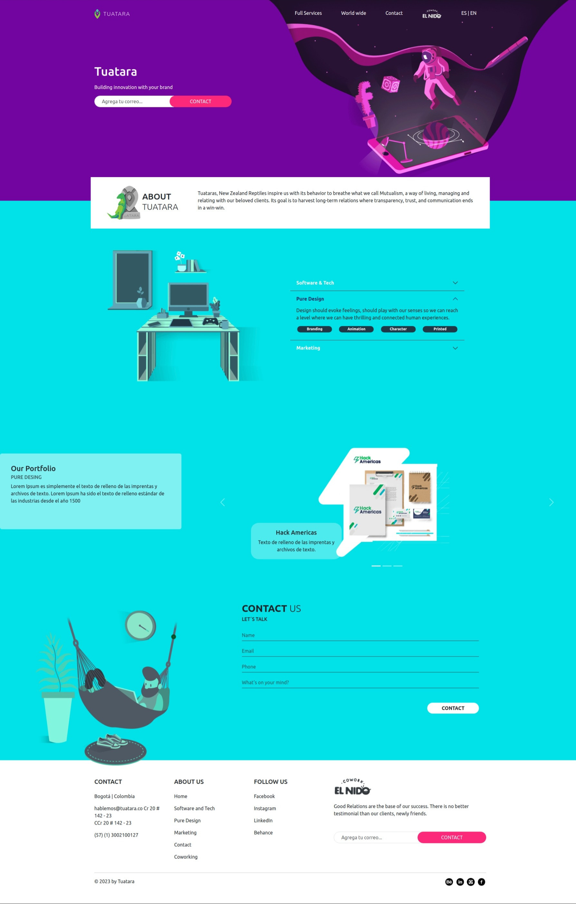

# Tuatara Theme + ACF

Prueba técnica para la empresa Tuatara en la creación de un tema hecho para Wordpress fuese totalmente editable todo su contenido exceptuando colores de fondo.

## Features:

- Uso ACF
- Edición menú
- Edición Titulo, subtitulos, párrafos e imágenes
- Diseño responsive Tablet / Móvil
- Implementación Bootstrap
- Adaptación modal bootstrap a menu móvil

  

## Instalación

1. Descargar el tema Tuatara del enlace suministrado o bajarlo del siguiente gitHub: https://dub.sh/tuatara

2. Luego de descomprimir, subir por FTP o Directo desde los archivos del cPanel si se tiene acceso.

3. Subir la carpeta tuatara a la ruta /wp-content/themes/ de WordPress a través de FTP o la ruta de carpetas dentro de cPanel.

## Alternativo

1. Si tiene acceso al WP instalar el tema en la sección de Temas dentro del DashBoard de WP.

2. Iniciar sesión en el panel de administración de WordPress.

3. Ir a Apariencia > Temas

4. Activar el tema Tuatara

## Contenido
La personalización del tu sitio se lleva acabo desde el panel de administración de WordPress/Paginas.
Con la ayuda de ACF, cada sección del tema se puede adaptar a gusto. Dentro de esta página, se encuentran una
variedad de campos listos para ser llenados. Cambia imágenes, textos y enlaces; el sitio esta optimizado y es
responsivo.